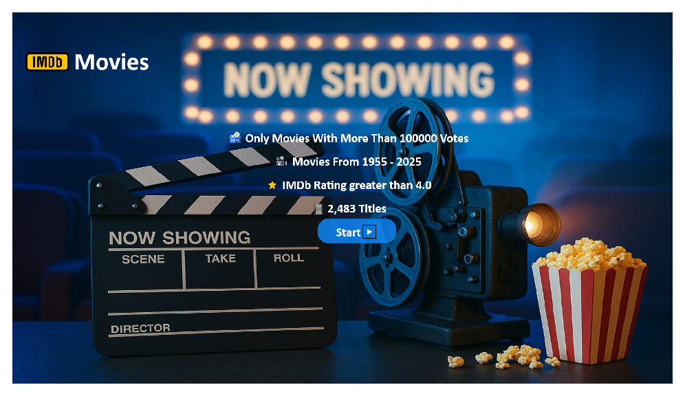
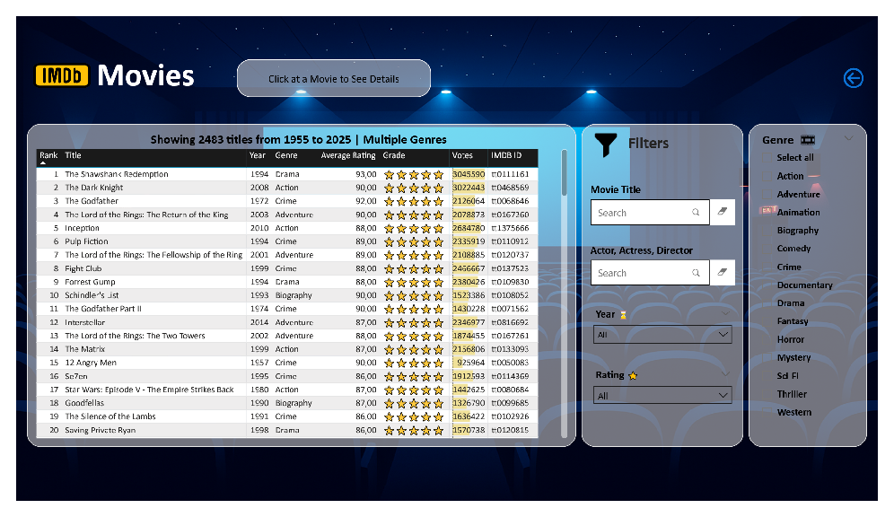
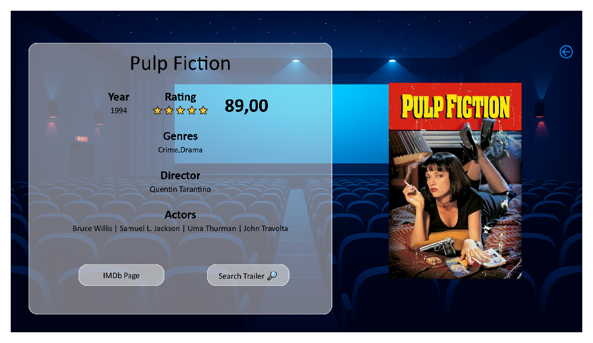

# 🎬 Power BI Dashboard: IMDb Movies Analysis

This Power BI project presents an interactive analysis of IMDb's movie data.

## 📂 Download the Dashboard

> ⚠️ Due to GitHub file size limits, the `.pbix` file is hosted externally, you can download and explore the full dashboard locally using Power BI Desktop.

- 📥 [Download PBIX from OneDrive](https://espiritosanto-my.sharepoint.com/:u:/g/personal/pedro_burini_uvvnet_com_br/EYoPjQo_jjlPo5YBiEC0dwsBjOhap0qBSeDQESC9LjksLA?e=96ZVjh)

## 🖼️ Dashboard Preview

## 🔍 Key Insights

- Number of movie titles from 1955 to 2025 with more than 100.000 votes
- Filtering by Rating, Genre, Actor, Actress, Director and Year
- Overview of Movie Titles
- IMDb Rating greater than 4.0
- Movie poster image displayed on mouse hover

## 🛠️ Tools & Technologies

- **Power BI Desktop**
- **IMDb Datasets** (Non-Commercial Use)
- **DAX** for calculated measures and filtering logic
- **Power Query** for data transformation
- **DAX Studio** to optimize performance and remove unused columns
- **Python & APIs**: movie poster images were obtained using the Python programming language and by connecting to the following API: The Movies Database API (TMDb) https://developer.themoviedb.org/docs/getting-started

## 📄 PDF Version

- [View PDF Report](assets/imdb-dashboard.pdf)

---

Made by [Pedro Burini]
